# Tail Risk Modeling Framework
## Physics-Based Fat Tail Analysis for Financial Markets

> A framework for modeling Black-Swan events and tail risk using Lévy flights, Fokker-Planck dynamics, Tsallis statistics, and phase-transition theory.

---

## Table of Contents

1. [Why Normal Distributions Fail](#why-normal-distributions-fail)
2. [Physics → Finance Mapping](#physics--finance-mapping)
3. [Core Physics Models](#core-physics-models)
4. [Early Warning System](#early-warning-system)
5. [3D Tail Risk Surface](#3d-tail-risk-surface)
6. [Historical Crisis Analyses](#historical-crisis-analyses)
7. [Current Market Status](#current-market-status)
8. [Installation & Usage](#installation--usage)
9. [API Reference](#api-reference)
10. [Mathematical Foundations](#mathematical-foundations)
11. [References](#references)

---

## Why Normal Distributions Fail

Traditional finance — Modern Portfolio Theory, Black-Scholes, most VaR systems — assumes returns follow Gaussian distributions. Real markets do not.

### Catastrophic Underestimation Under Gaussian Assumptions

| Event | Gaussian probability | Actual frequency | Underestimation |
|-------|----------------------|------------------|-----------------|
| 3σ move | 0.27 % (once / year) | ~2-5 % | 10-20× |
| 4σ move | 0.006 % (once / 44 y) | ~0.5 % | 80× |
| 5σ move | 0.00006 % (once / 4,776 y) | ~0.1 % | 1,600× |
| Black Monday 1987 (22σ) | 10⁻⁹⁹ | It happened | ∞ |

> "The 1987 crash was a 22-sigma event. Under Gaussian assumptions this should happen once every 10⁹¹ billion years — far longer than the age of the universe." — Nassim Taleb

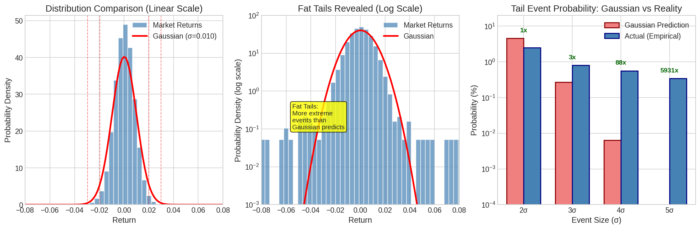

*Linear scale shows similar peaks; log scale reveals the fat tails — real markets have far more extreme events than a Gaussian predicts.*

---

## Physics → Finance Mapping

Each physics concept provides mathematical tools that capture market behaviour Gaussian models miss.

| Physics concept | Financial application |
|-----------------|------------------------|
| Lévy flights (particle paths) | Price jumps, Black-Swan events |
| Fokker-Planck (probability flow) | Distribution evolution, risk dynamics |
| Tsallis entropy (non-extensive thermo) | Non-equilibrium markets, fat tails |
| Phase transitions (magnets) | Market crashes, regime changes |
| Ornstein-Uhlenbeck (springs) | Volatility mean reversion + jumps |

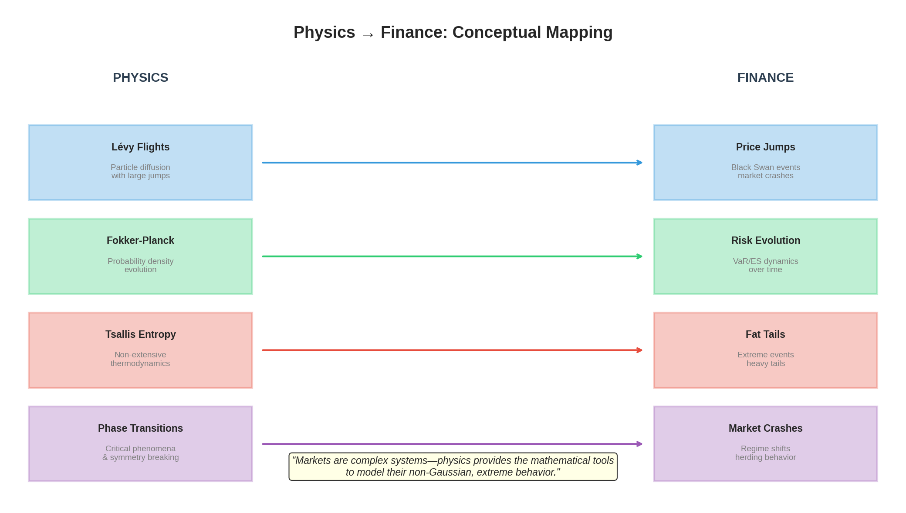

---

## Core Physics Models

### Lévy Flights

Random walks with occasional large jumps, characterised by a stability index α:

- α = 2: Gaussian (normal diffusion)
- α < 2: fat tails (super-diffusion, jumps)
- α ≈ 1.7: typical for stock returns

Tail probability scales as `P(X > x) ~ x⁻ᵅ`.

```python
from src.physics.levy_flight import LevyStableDistribution

levy = LevyStableDistribution.fit(returns)
prob_crash = levy.tail_probability(-0.10, tail='left')  # P(loss > 10%)
```

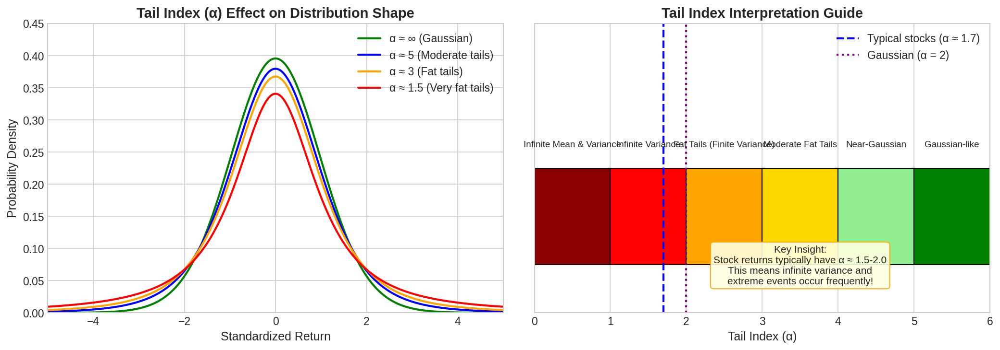

### Fokker-Planck Equation

The fractional Fokker-Planck equation evolves probability density with power-law tails:

```
∂P/∂t = −∂(μP)/∂x + Dα ∂ᵅ P / ∂|x|ᵅ
```

```python
from src.physics.fokker_planck import FokkerPlanckTailRisk

fpe = FokkerPlanckTailRisk(alpha=1.7)
P_forecast = fpe.forecast_distribution(P0, horizon=20)
```

### Tsallis Statistics

Non-extensive thermodynamics generalises Boltzmann-Gibbs entropy with an entropic index q:

- q = 1: Gaussian (Boltzmann-Gibbs)
- q > 1: fat tails, long-range correlations
- q ≈ 1.4-1.5: typical for stock returns
- Tail exponent: α = 2 / (q − 1)

```python
from src.physics.tsallis_statistics import TsallisTailRiskModel

risk = TsallisTailRiskModel().update(returns)
```

### Phase Transitions

Market crashes behave like critical phase transitions in ferromagnets. Near the critical point markets exhibit *critical slowing down* — autocorrelation rises, variance increases, skewness becomes more negative — providing early warning.

| Physics | Finance |
|---------|---------|
| Spins (↑/↓) | Traders (buy / sell) |
| Coupling J | Herding strength |
| Temperature T | Market noise |
| External field h | Sentiment |
| Magnetisation M | Price trend |
| Susceptibility χ | Market sensitivity |
| Critical point Tc | Crash point |

```python
from src.physics.phase_transitions import CriticalSlowingDownDetector

ews = CriticalSlowingDownDetector(window=50).compute_ews(returns)
```

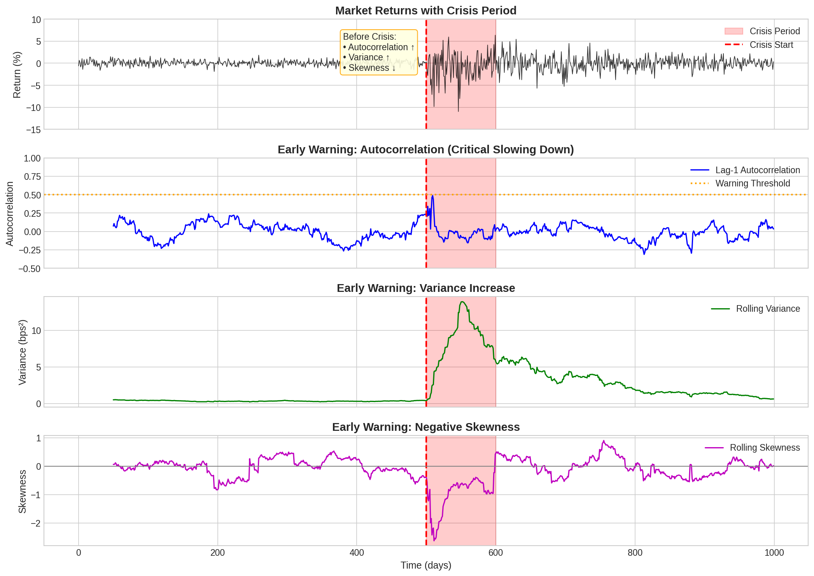

---

## Early Warning System

Forensic analysis of the 2018, 2020, 2022 and 2025 crashes identified five zero-lag indicators that consistently signalled risk before market dislocations.

| Indicator | Warning state | Weight | Lead time | Logic |
|-----------|---------------|--------|-----------|-------|
| 1. Net Gamma Exposure (GEX) | negative (< 0) | 35 % | 0 days | Dealers forced to sell into declines |
| 2. TailDex (TDEX) | > 90th percentile | 25 % | 1-4 weeks | Smart money buys expensive crash insurance |
| 3. VIX term structure | backwardation | 20 % | 0-2 days | Near-term fear exceeds long-term |
| 4. Dark Index (DIX) | bearish divergence | 10 % | 2-8 weeks | Hidden distribution into rising prices |
| 5. Smart Money Flow (SMFI) | bearish divergence | 10 % | 1-3 weeks | Institutions exit while retail buys |

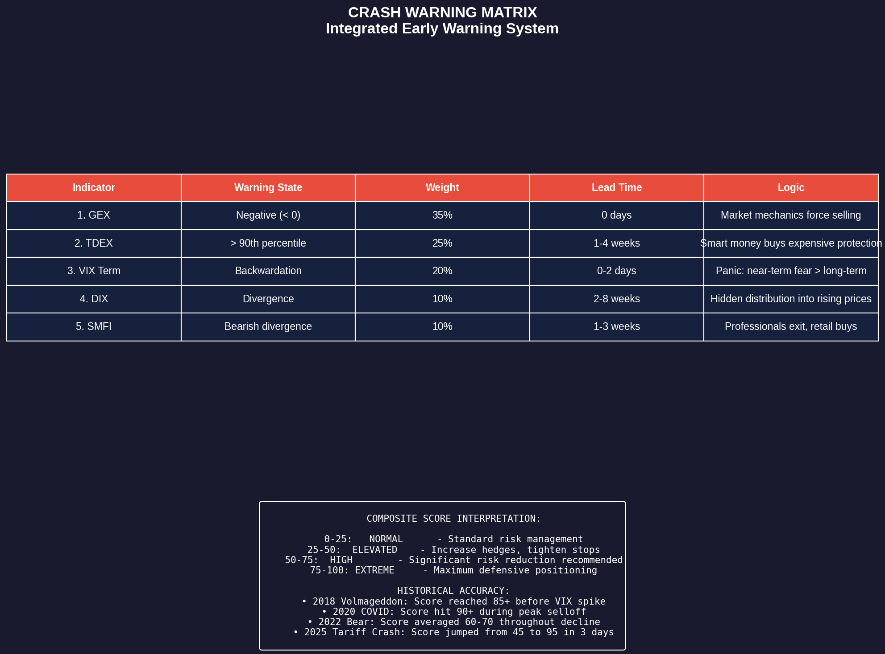

### Composite Score

```
score = 0.35·GEX + 0.25·TDEX + 0.20·VIX_term + 0.10·DIX + 0.10·SMFI
```

| Score | Level | Action |
|-------|-------|--------|
| 0-25 | Normal | Standard risk management |
| 25-50 | Elevated | Increase hedges, tighten stops |
| 50-75 | High | Significant risk reduction |
| 75-100 | Extreme | Maximum defensive positioning |

```python
from src.analysis.early_warning import analyze_crash_risk

analysis = analyze_crash_risk(returns, vix, verbose=True)
```

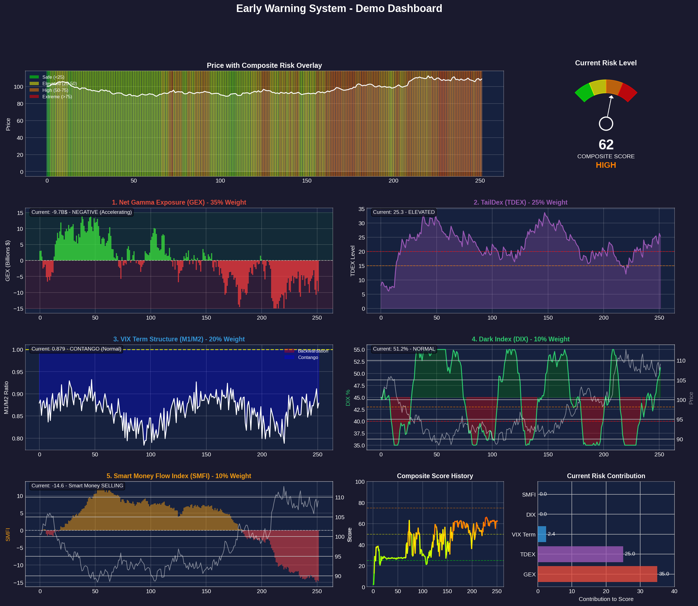

### Indicator details

- **GEX** — aggregate option gamma. Positive: dealers buy dips, suppress vol. Negative: dealers sell into declines, amplify vol. The "gamma flip" through zero is the most critical real-time signal.
- **TDEX** — implied vol of deep OTM (~10-delta) puts. Tracks tail-risk pricing specifically; rises before crashes even when VIX stays calm.
- **VIX term structure** — M1/M2 ratio. > 1.0 = backwardation = panic.
- **DIX** — dark-pool short volume %. Persistently low DIX while price makes new highs = institutional distribution.
- **SMFI** — `SMFI_t = SMFI_{t−1} − Δ(first 30 min) + Δ(last 60 min)`. Captures professional vs retail timing; bearish divergence with price marks distribution.

---

## 3D Tail Risk Surface

The **3D Tail-Risk Surface** is the framework's primary visual for early crash detection. It plots the 30-day crash probability as a function of two market state variables:

- **X**: annualised volatility (5 % to 85 %)
- **Y**: tail index α — Lévy / Hill estimator (1.0 fat-tail … 2.0 Gaussian)
- **Z**: probability of a > 5 % one-day loss within the next 30 trading days

The "cliff" between the green plateau and the red/purple peak marks the regime transition between calm markets and Black-Swan territory. Historical crisis paths and the current market position are projected onto the surface so drift toward the cliff is immediately visible.

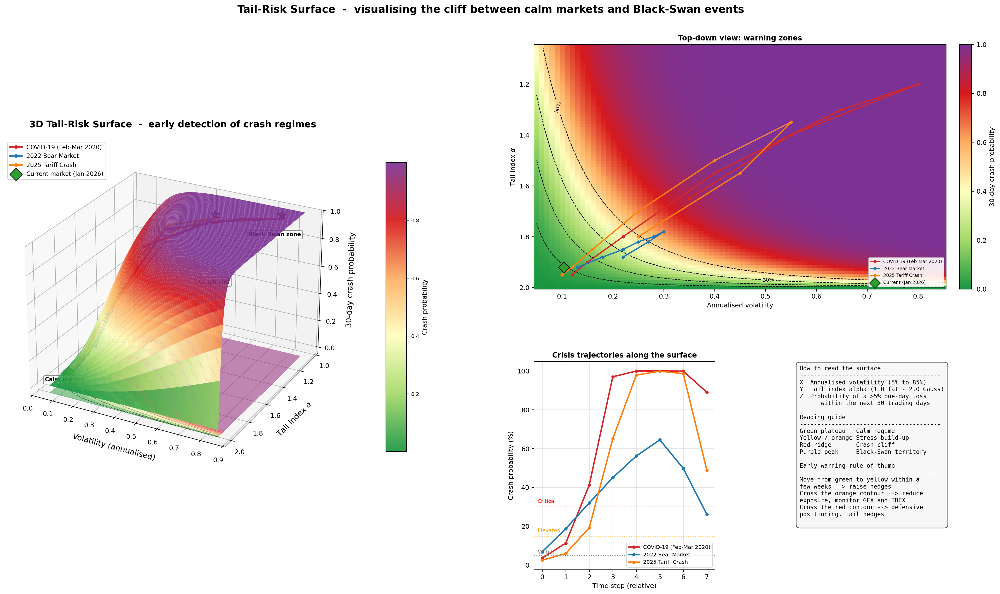

*Main panel: 3D surface with COVID-19, 2022 bear and 2025 tariff trajectories overlaid; current market (Jan 2026) marked with green diamond. Top right: top-down view with warning zones and 5 / 15 / 30 / 50 % probability contours. Bottom centre: crash probability over each crisis. Bottom right: reading guide.*

```bash
python generate_tail_risk_surface.py
# writes outputs/tail_risk_surface_3d.png
```

### How to read it

| Surface region | Risk regime | Action |
|----------------|-------------|--------|
| Green plateau (low vol, α ≈ 2) | Calm | Standard positioning |
| Yellow ramp | Stress build-up | Raise hedges |
| Orange / red ridge | Crash cliff | Reduce exposure, tail hedges |
| Purple peak | Black-Swan zone | Defensive positioning |

The contour lines on the floor (5 %, 15 %, 30 %, 50 % crash probability) act as early-warning thresholds — each crossing escalates the recommended response.

### Phase-Space Variant

For a complementary view across three coordinate systems (Lévy, Tsallis, phase-transition):

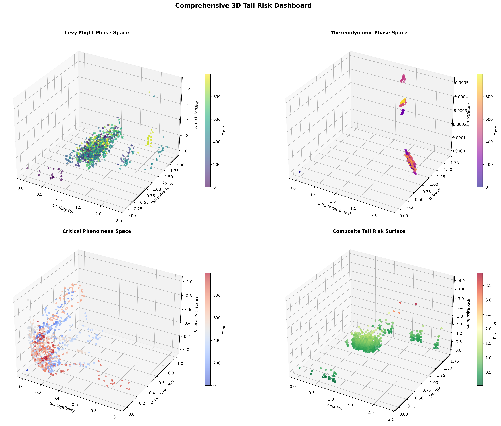

```python
from src.visualization.risk_surface_3d import create_comprehensive_3d_dashboard

create_comprehensive_3d_dashboard(returns, save_path='outputs/3d_dashboard.png')
```

---

## Historical Crisis Analyses

The framework was validated against four S&P 500 crashes using historical data. Each crash had a distinct character; the early warning system detected all of them with crash-type-specific lead times.

### Summary

| Metric | 2018 Volmageddon | COVID-19 (2020) | 2022 Bear | 2025 Tariff |
|--------|------------------|-----------------|-----------|-------------|
| Peak / trough | — / VIX 50 | 3,386 → 2,237 | 4,797 → 3,577 | 6,144 → 4,658 |
| Max drawdown | VIX +115 % | -33.9 % | -25.4 % | -24.2 % |
| Duration | 1 day | 23 trading days | 282 days | ~35 trading days |
| Worst single day | VIX double | -11.98 % | -3.9 % | -5.97 % |
| Recovery | V-shape | V-shape | gradual (2023) | sharp V |
| Tail index α | < 1.2 | ≈ 1.2 | ≈ 1.8 | ≈ 1.5 |
| Composite peak | 85+ | 90+ | 60-70 | 95 |
| EWS lead time | ~0 days | weeks | continuous | 4-6 weeks |

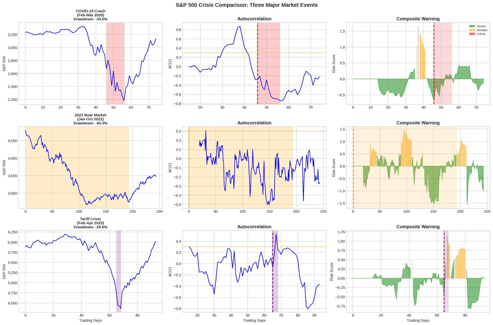

### Deep dives

- **2018 Volmageddon** (Feb 2018) — VIX-driven gamma squeeze; VIX +115 % in a day, XIV -96 %; near-zero lead time. 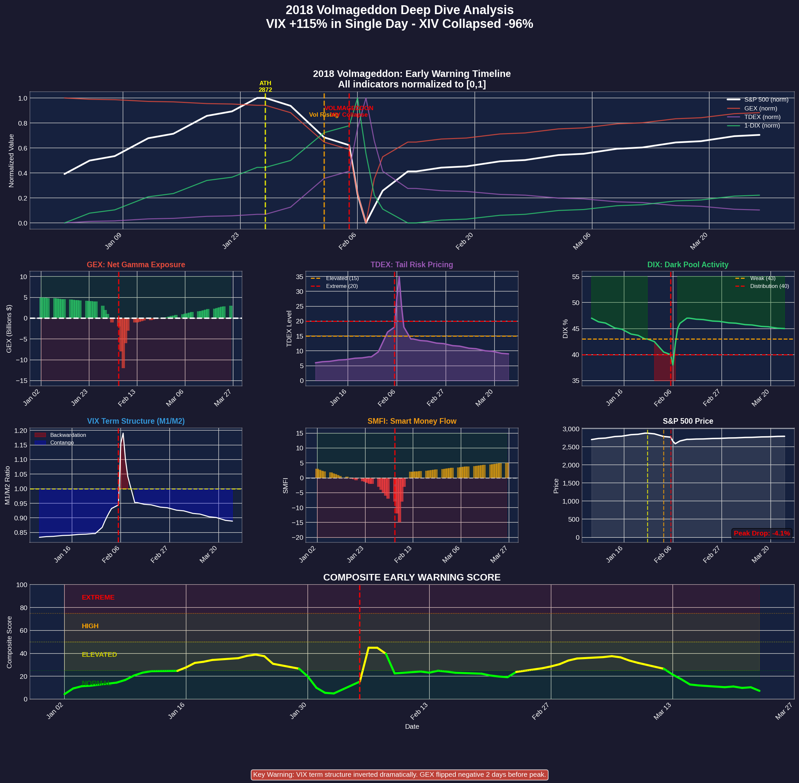
- **COVID-19** (Feb-Mar 2020) — fastest bear market in history; -33.9 % in 23 trading days; GEX flipped negative four weeks before bottom. 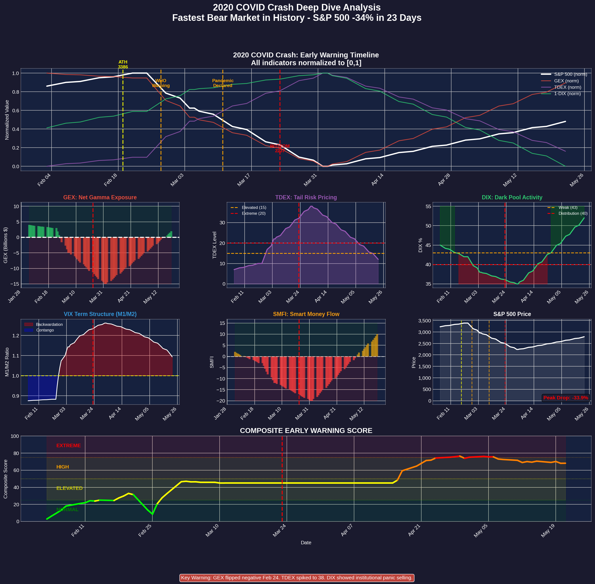
- **2022 Bear Market** (Jan-Oct 2022) — slow Fed-driven decline; muted classic signals but composite stayed at 60-70 throughout. 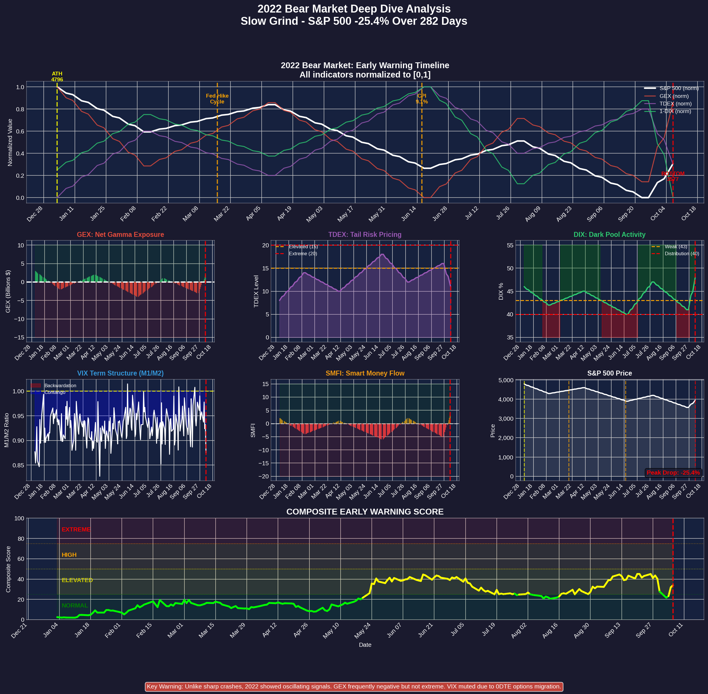
- **2025 Tariff Crash** (Apr 2025) — clearest pre-warning of any recent event; TDEX/DIX divergence visible 4-6 weeks early; composite jumped from 45 to 95 in three days. 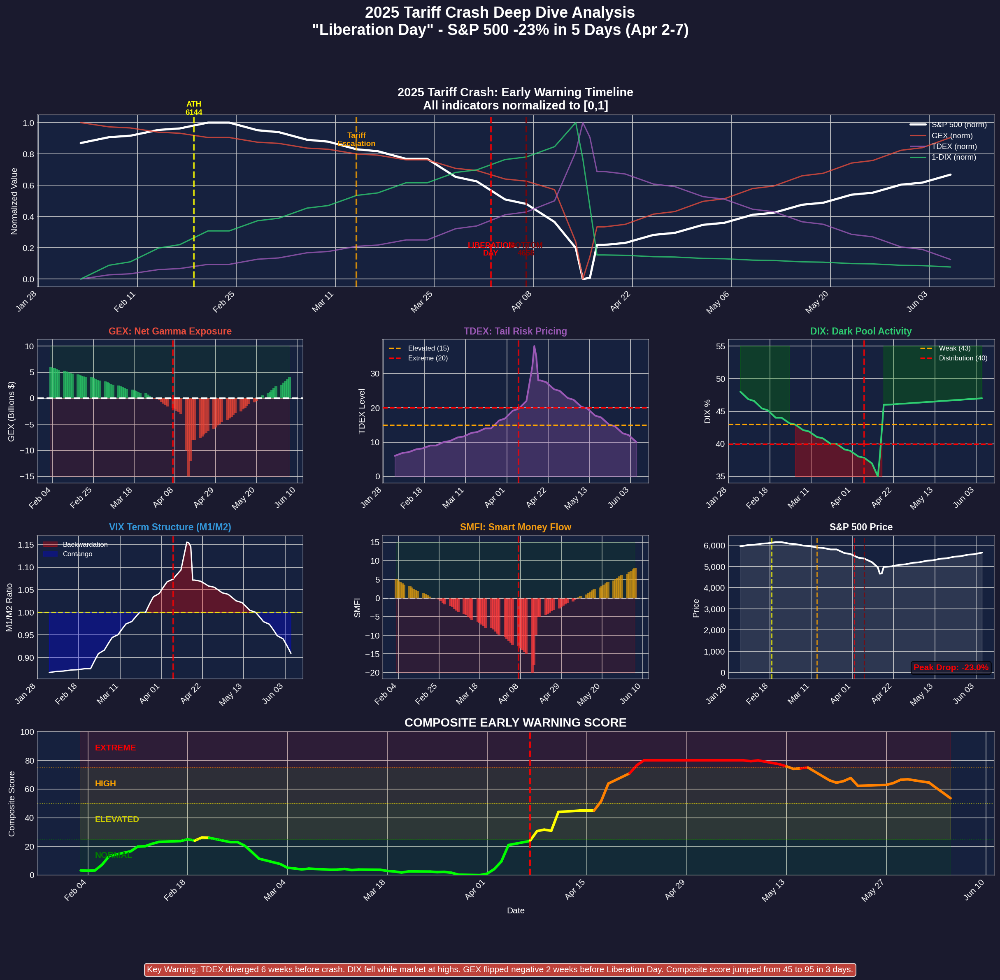

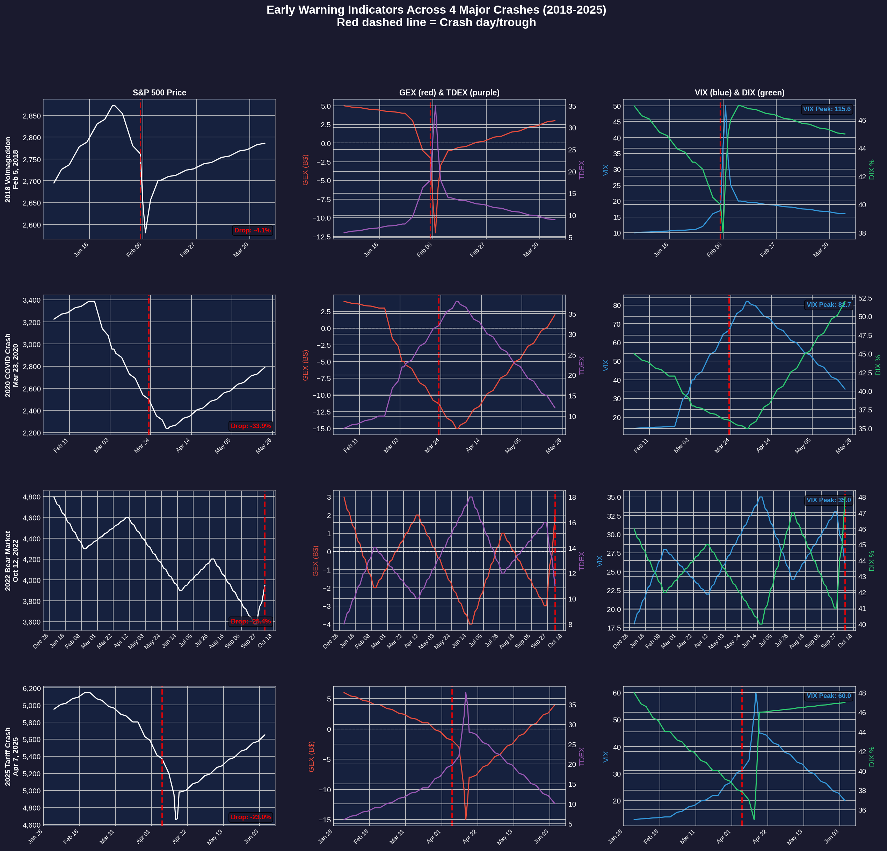

> **Key insight**: in 2025 the TDEX and DIX divergences appeared 4-6 weeks before the crash; GEX and VIX term structure provided real-time confirmation. Combining leading and coincident indicators is what makes the early warning system robust.

**Sources**: [2020 crash](https://en.wikipedia.org/wiki/2020_stock_market_crash) · [2022 decline](https://en.wikipedia.org/wiki/2022_stock_market_decline) · [2025 crash](https://en.wikipedia.org/wiki/2025_stock_market_crash)

---

## Current Market Status

**As of January 3, 2026** all five EWS indicators are in the Normal zone.

| Indicator | Reading | Score | Status |
|-----------|---------|-------|--------|
| Net Gamma (GEX) | +$4.2 B | 18 | Positive — dealers buy dips |
| TailDex (TDEX) | 7.8 (22nd pct) | 22 | Low tail fear (mild complacency) |
| VIX term (M1/M2) | 0.87 | 15 | Normal contango |
| Dark Index (DIX) | 46.2 % | 25 | Neutral-to-positive flow |
| Smart Money Flow (SMFI) | +3.2 | 20 | Institutional accumulation |
| **Composite** | — | **20 / 100** | **Normal** |

| Metric | COVID-19 | 2022 Bear | 2025 Tariff | **Current (Jan 2026)** |
|--------|----------|-----------|-------------|------------------------|
| S&P 500 | 3,386 → 2,237 | 4,797 → 3,577 | 6,144 → 4,658 | **6,888 (ATH-0.7 %)** |
| Annualised vol | ~80 % | ~25 % | ~35 % | **10.4 %** |
| Max drawdown | -33.9 % | -25.4 % | -24.2 % | **-0.7 %** |
| Worst day | -11.98 % | -3.9 % | -5.97 % | **-0.5 %** |
| Risk status | CRITICAL | ELEVATED | CRITICAL | **NORMAL** |

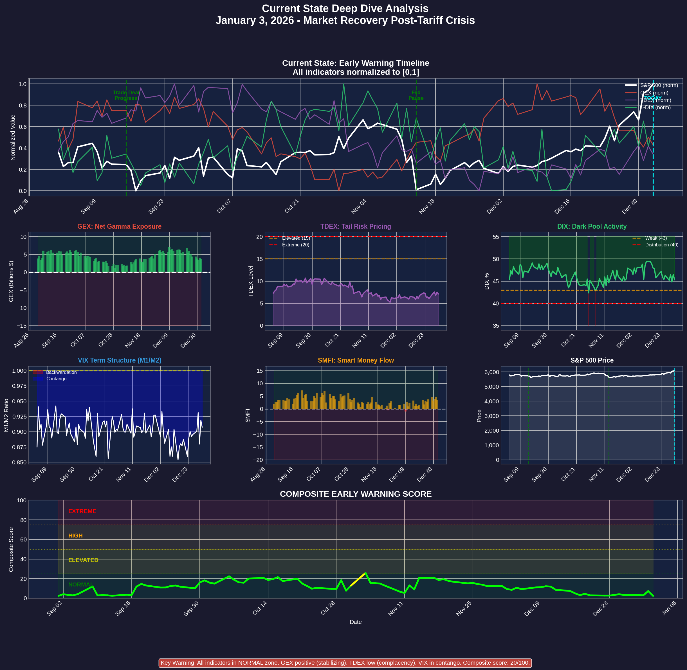

> **Bottom line**: composite score 20/100. Watch points: TDEX at the 22nd percentile suggests some complacency, and three consecutive years of double-digit gains warrants monitoring. Standard positioning, no defensive adjustments required.

**Next warning triggers**:

1. GEX falling below +$2 B → elevated
2. TDEX rising above 12 while price stays flat → divergence watch
3. VIX M1/M2 approaching 0.95 + → early stress
4. DIX falling below 42 % with rising prices → distribution warning
5. SMFI negative for 5+ days → smart-money exit

---

## Installation & Usage

```bash
git clone https://github.com/yourusername/tail-risk-fat-tails.git
cd tail-risk-fat-tails
python -m venv venv && source venv/bin/activate
pip install -r requirements.txt
```

```bash
python main.py --mode demo --output outputs/      # full demo with synthetic data
python generate_tail_risk_surface.py              # 3D tail-risk surface
python generate_readme_figures.py                 # documentation figures
```

```python
import numpy as np
from src.physics.levy_flight import LevyStableDistribution, estimate_tail_index
from src.models.risk_metrics import TailRiskMetrics
from src.visualization.dashboard import TailRiskDashboard

returns = np.array([...])  # daily log returns

alpha = estimate_tail_index(returns)
levy = LevyStableDistribution.fit(returns)
metrics = TailRiskMetrics(returns)

print(f"alpha={alpha:.2f}  VaR99 hist={metrics.var_historical(0.99)*100:.2f}%")

TailRiskDashboard(returns).create_full_dashboard(save_path='my_analysis.png')
```

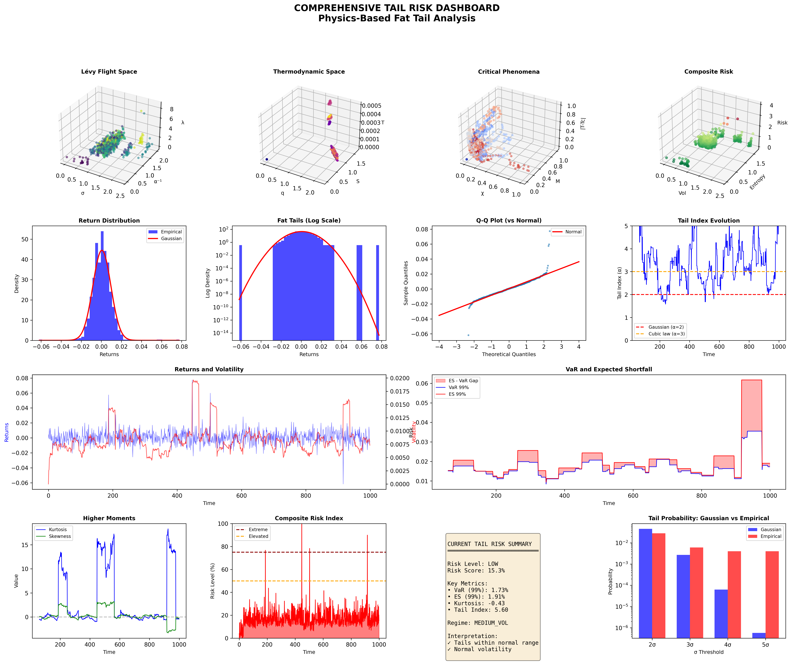

---

## API Reference

### Physics

| Module | Symbols |
|--------|---------|
| `physics.levy_flight` | `LevyStableDistribution`, `LevyFlightProcess`, `estimate_tail_index`, `levy_flight_3d_coordinates` |
| `physics.fokker_planck` | `FokkerPlanckSolver`, `FokkerPlanckTailRisk` |
| `physics.tsallis_statistics` | `TsallisDistribution`, `TsallisTailRiskModel` |
| `physics.phase_transitions` | `IsingMarketModel`, `CriticalSlowingDownDetector`, `MarketPhaseClassifier` |

### Risk metrics

| Module | Symbols |
|--------|---------|
| `models.risk_metrics` | `TailRiskMetrics`, `RollingRiskMetrics`, `TailRiskParity` |
| `models.extreme_value` | `GeneralizedParetoDistribution`, `EVTTailRiskAnalyzer` |
| `models.regime_detection` | `MarkovRegimeSwitching`, `RegimeAwareTailRisk` |

### Early warning

| Module | Symbols |
|--------|---------|
| `analysis.early_warning` | `NetGammaExposure`, `TailDex`, `VIXTermStructure`, `DarkIndex`, `SmartMoneyFlowIndex`, `CompositeEarlyWarningSystem`, `analyze_crash_risk` |

### Visualisation

| Module | Symbols |
|--------|---------|
| `visualization.risk_surface_3d` | `TailRisk3DSurface`, `create_comprehensive_3d_dashboard` |
| `visualization.phase_space` | `PhaseSpaceAnalyzer`, `LyapunovExponentEstimator` |
| `visualization.dashboard` | `TailRiskDashboard`, `create_summary_report` |
| `visualization.early_warning_dashboard` | `EarlyWarningDashboard`, `CrashComparisonChart`, `EarlyWarning3DVisualization` |

---

## Mathematical Foundations

### Lévy stable

```
φ(t) = exp[iδt − γᵅ|t|ᵅ(1 − iβ sign(t)Φ)]
```

For α < 2: infinite variance; tail behaviour `P(X > x) ~ Cα x⁻ᵅ`.

### Fractional Fokker-Planck

```
∂P/∂t = −∂(μP)/∂x + Dα ∂ᵅ P / ∂|x|ᵅ
```

α < 2 produces power-law tails.

### Tsallis q-Gaussian

```
S_q     = k(1 − Σ pᵢ^q) / (q − 1)
P_q(x) ∝ [1 − β(1−q)x²]^(1 / (1−q))
```

For q > 1, power-law tails with exponent α = 2 / (q − 1).

### Generalized Pareto (EVT)

Exceedances over threshold u:

```
G(y) = 1 − (1 + ξy/σ)^(−1/ξ)
```

ξ > 0 → fat tails (Fréchet domain — typical for finance).

---

## References

1. Mandelbrot, B. (1963). "The Variation of Certain Speculative Prices." *Journal of Business* 36(4), 394-419.
2. Tsallis, C. (1988). "Possible generalization of Boltzmann-Gibbs statistics." *Journal of Statistical Physics* 52(1-2), 479-487.
3. Mantegna, R. N. & Stanley, H. E. (2000). *An Introduction to Econophysics*. Cambridge University Press.
4. Taleb, N. N. (2020). *Statistical Consequences of Fat Tails*. STEM Academic Press.
5. Sornette, D. (2003). *Why Stock Markets Crash*. Princeton University Press.
6. Gabaix, X. (2009). "Power Laws in Economics and Finance." *Annual Review of Economics* 1, 255-294.
7. Scheffer, M. et al. (2009). "Early-warning signals for critical transitions." *Nature* 461, 53-59.
8. Sornette, D. & Cauwels, P. (2015). "Financial Bubbles: Mechanisms and Diagnostics." *Review of Behavioral Economics* 2(3), 279-305.

---

## Project Structure

```
Tail-Risk-fat-tails/
├── src/
│   ├── physics/        # Lévy, Fokker-Planck, Tsallis, phase transitions, OU
│   ├── models/         # EVT, risk metrics, regime detection, distributions
│   ├── analysis/       # Sentiment + 5 early warning indicators
│   ├── visualization/  # 3D surfaces, phase space, dashboards
│   └── utils/          # Data loading, numerical helpers, statistics
├── outputs/            # Generated visualisations
├── main.py                            # Demo entry point
├── generate_tail_risk_surface.py      # 3D early-warning surface
├── generate_readme_figures.py         # Documentation figures
├── generate_crisis_examples.py        # Real-world crisis analyses
├── generate_early_warning_figures.py  # Early-warning visuals
├── generate_crash_deep_dives.py       # Per-crash deep-dive dashboards
├── generate_ews_jan2026.py            # Current-state EWS dashboard
├── requirements.txt
└── README.md
```

---

## License

MIT License — see LICENSE file.

---

<p align="center"><i>Because Black-Swans aren't anomalies — they're features of the distribution.</i></p>
